---

### Database

#### Link: https://www.kaggle.com/sansuthi/life-expectancy
#### License: CC0

---

### Used libraries

- Pandas
- Matplotlib
- Seaborn

---

### Description

#### The database has an entity, which is the place, the code which is the abbreviation for the place, and 70 columns with years from 1950 to 2019 showing life expectancy in those places

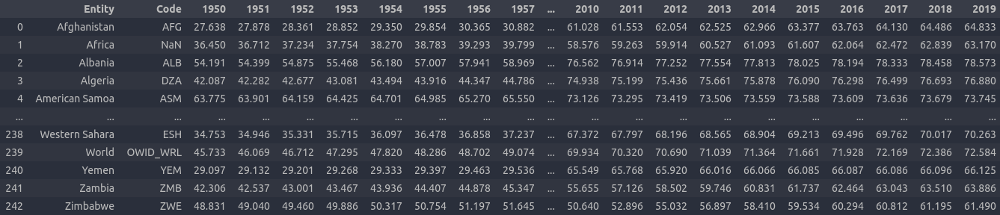

---

### Best and worst expectations

### Worst: Cambodia(1977)

#### First I create a new database from the original one with only the years, so it is easier to figure out the parameters further on. By selecting all values in the database and using the `min()` function, we can find the smallest values in the database. With one more `min()` we discovered the worst expectation. We create the variables `minval_row` and `minval_col` to make it easier to find where the worst expectation is located. We found that the registry is with an expectation of approximately 19 years, in 1977, and is in line 37 of the database. 

#### Creating a more complete dataset with all the information, we find that the country with the worst expectation is Cambodia in 1977.

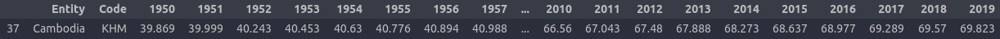

### Why the worst expectancy?

#### During the years 1975 until 1979 Cambodia was experiencing a genocide with a systematic persecution and killing of Cambodians by the Khmer Rouge. It resulted in between 1.5 and 2 million deaths, so we have the worst life expectancy in 1977. Not only in 1977, but between several years before and after Cambodia was living with very low expectations, as you can see in the graph I created with seaborn and matplotlib:

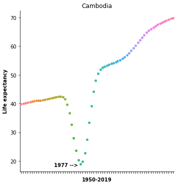

#### With this other graph you can see Cambodia compared with other places, in the same year, 1977:

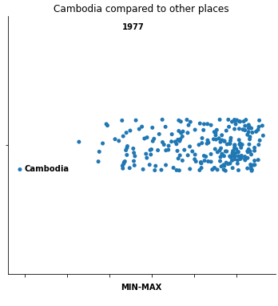

---

### Best: Monaco(2019)

#### Using the database with only the years data, I did the same process, only now using the `max()` function. We found the best expectation value and created variables maxval_row and maxval_col to make it easier to find where the best expectation is located. Found that registry has approximately 87 years of expectation and is from 2019.

#### Creating a more complet dataset with all the information, we find that the country with the best expectation in Monaco in 2019. Even, we do not have the 2020 and 2021 data in that database the Monaco expectation remains the best expectation.

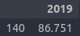

### Why the best expectancy?

#### The standard of living and the health care system contribute to this life expectancy in Monaco. Another factor is that most people in Monaco consume healthy Mediterranean food and spend a lot of time relaxing outdoors. You can see the expectation over time with this graph I created:

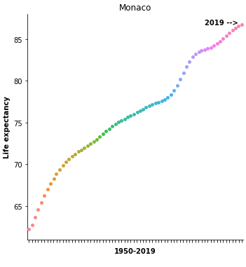

#### With this other graph you can see Monaco compared with other places, in the same year, 2019:

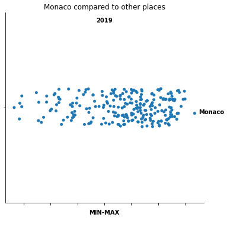

---

### Life expectancy in Americas

#### I created a new database from the original one with only the registrations from the Americas:

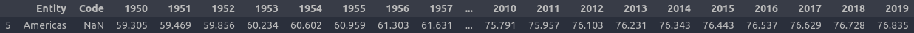

#### With this dataset we can discover tha best and worst expectation too. Which seems to have a more normalized growth curve, compared to other places:

#### Worst(1950)

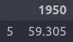

#### Best in the database (2019)

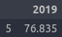

#### We can also see the historical chart in the Americas:

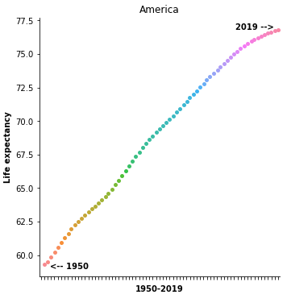

#### And another graph comparing it to other places:

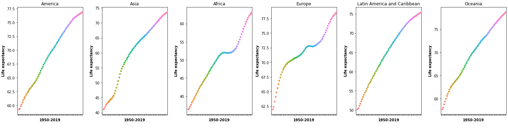

---

### Best and worst expectations recently

#### Worst: Central African Republic

#### I did the same process and found that Central African Republic has the worst expectation currently in the database. With 53 years of expectation, the poor country faces several internal conflicts. Some graphs:

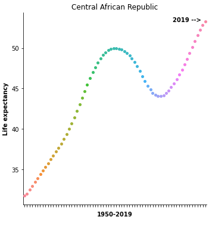

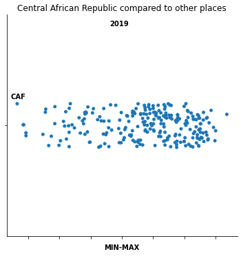

### Best: Monaco

#### Monaco is the best of all time and the best recently. Since I have already done the Monaco analysis, you can see it [here](#best-monaco2019).
